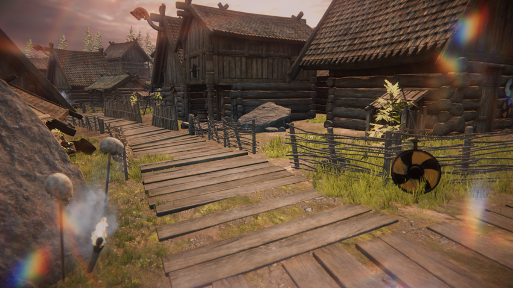
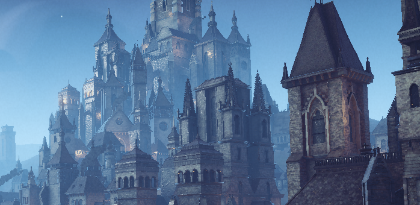
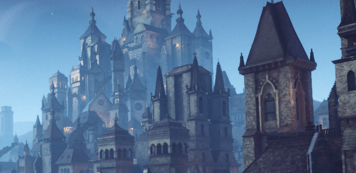
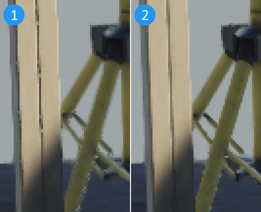
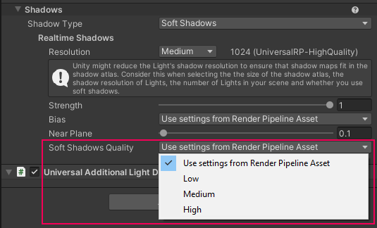

# What's new in URP 16 (Unity 2023.2)

This section contains information about new features, improvements, and issues fixed in URP 16.

For a complete list of changes made in URP 16, refer to the [Changelog](xref:changelog).

## Features

This section contains the overview of the new features in this release.

### Screen Space Lens Flare

URP 16 includes a new [Screen Space Lens Flare](../shared/lens-flare/post-processing-screen-space-lens-flare.md) post-processing override, in addition to the existing [Lens Flare (SRP)](../shared/lens-flare/lens-flare-component.md) component. The override uses what's on the screen to create multiple types of lens flare, based on the texture from the [Bloom](../post-processing-bloom.md) override. Screen space lens flares are useful for bright spots in your scene that appear depending on the camera view, for example a bright specular reflection on a shiny metal object, or a bright outside area viewed from a dark indoor area.

### Temporal anti-aliasing (TAA)

Temporal anti-aliasing (TAA) is a spatial multi-frame anti-aliasing technique that uses results from current and previous rendered frames to remove jaggies in the current frame and reduce temporal judder between frames.

TAA uses Motion Vectors to reduce or avoid shimmer and ghosting artifacts caused by moving objects that end up being in different pixel locations in different frames.

To enable TAA for a Camera:

* Select the Camera.

* In the Inspector, in the **Rendering** section, select **Temporal Anti-aliasing (TAA)** in the **Anti-aliasing** property.

The following image shows a frame with TAA off:

The following image shows a frame with TAA on:

### High Dynamic Range (HDR) Output

[High Dynamic Range](https://en.wikipedia.org/wiki/High_dynamic_range) content has a wider color gamut and greater luminosity range than standard definition content.

URP can output HDR content for displays which support that functionality.

To activate HDR output, navigate to **Project Settings** > **Player** > **Other Settings** and enable **Use display in HDR mode**.

## Improvements

This section contains the overview of the major improvements in this release.

### FXAA quality improvements

This URP version improves the overall quality of FXAA. This implementation provides better edge anti-aliasing (removing odd edge artifacts seen with the previous implementation) and better retention of texture quality. The improvement does not affect performance. The output quality is now comparable to the low and medium SMAA presets but with better performance.

The following image shows the effect of the previous FXAA implementation (1) and the new one (2):

### Public API documentation improvements

In this release a significant amount of missing public API descriptions were added.

### New Soft Shadows Quality property

URP Asset now contains a **Quality** property under the **Soft Shadows** property, which lets you select the quality level of soft shadow processing. By default, all Lights use the quality setting from the URP Asset, and you can override that setting per Light using the **Soft Shadows Quality** property.

The **Quality** property in the URP Asset:

The **Soft Shadows Quality** property on a Light:

## Issues resolved

For a complete list of issues resolved in URP 16, refer to the [Changelog](xref:changelog).

## Known issues

For information on the known issues in URP 16, refer to the section [Known issues](../known-issues.md).
